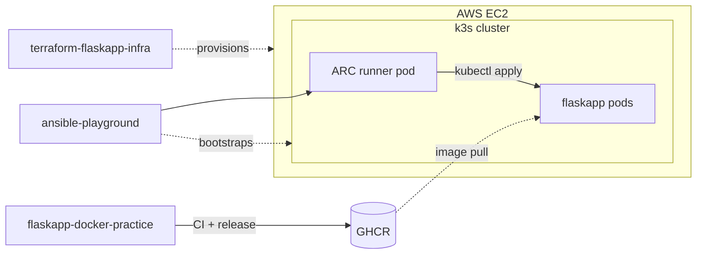

# terraform-flaskapp-infra

[](https://github.com/prsmalley/terraform-flaskapp-infra/actions/workflows/ci.yml)
[](LICENSE)

**Status:** EC2 currently provisioned and hosting the flaskapp deployment, **live at https://flaskapp.prsmalley.dev** via Cloudflare Tunnel. Inbound on the SG is still restricted to operator IP — Cloudflare reaches the app via an outbound-initiated tunnel, not through SG inbound rules.

This repo owns the AWS infrastructure: a single EC2 instance, SSH key pair, and security group. It's one of three repos that together build, provision, and deploy a Flask app to a k3s cluster on AWS EC2:

- **[flaskapp-docker-practice](https://github.com/prsmalley/flaskapp-docker-practice)** — builds and publishes the container image to GHCR.
- **terraform-flaskapp-infra** — provisions the EC2 host.
- **[ansible-playground](https://github.com/prsmalley/ansible-playground)** — bootstraps k3s and deploys the app via ephemeral self-hosted runners (ARC) running inside the cluster.

See [ARCHITECTURE.md](https://github.com/prsmalley/ansible-playground/blob/main/ARCHITECTURE.md) for the full design.



## Repo layout

```
.
├── main.tf                    # Provider, AMI lookup, key pair, security group, EC2 instance
├── variables.tf               # Input variables (region, instance type, SSH key, IP)
├── outputs.tf                 # Public IP, DNS, instance ID, SSH command
├── terraform.tfvars.example   # Copy to terraform.tfvars and fill in
├── .terraform.lock.hcl        # Pinned provider versions (committed)
├── .github/
│   ├── workflows/ci.yml       # fmt, validate, tflint, Trivy IaC scan, gitleaks
│   └── dependabot.yml         # Weekly bumps for pinned actions + AWS provider
└── .gitignore                 # Excludes *.tfstate, *.tfvars, .terraform/
```

## What it builds

- A `t3.small` Ubuntu 22.04 EC2 instance (enough RAM for k3s + ARC).
- An SSH key pair from your local public key.
- A security group with three inbound rules, all restricted to your IP:
  - `22/tcp` — SSH
  - `80/tcp` — HTTP (for the deployed app)
  - `6443/tcp` — Kubernetes API (for remote `kubectl`)
- No `user_data` — Ansible handles the host bootstrap (see ansible-playground).
- Outputs the public IP, public DNS, instance ID, and a ready-to-paste SSH command.

## Prerequisites

- AWS account with an IAM user that has EC2 + IAM write permissions.
- AWS CLI configured (`aws configure`) on your machine.
- Terraform 1.5+ (`brew install terraform`).
- A local SSH public key (e.g. `~/.ssh/id_ed25519.pub`).

## Run it

```bash
cp terraform.tfvars.example terraform.tfvars
# Edit terraform.tfvars: set ssh_public_key_path and my_ip
# Find your IP with: curl -s https://api.ipify.org

terraform init    # downloads the AWS provider
terraform plan    # dry run — preview the changes
terraform apply   # type "yes" to confirm
```

Outputs include the public IP and an SSH command:

```bash
ssh -i ~/.ssh/id_ed25519 ubuntu@$(terraform output -raw public_ip)
```

When done, save costs:

```bash
terraform destroy
```

## After `terraform apply`: bootstrap the host

The instance comes up as bare Ubuntu. Run Ansible from
[ansible-playground](https://github.com/prsmalley/ansible-playground) to
install k3s:

```bash
# In ansible-playground/, with the EC2 IP added to inventory.ini under [appservers]
ansible-playbook bootstrap-k3s.yml
```

After bootstrap, ARC + workflow setup happens via `helm install` on the
cluster. See ansible-playground's ARCHITECTURE.md for the full flow.

## CI pipeline (`.github/workflows/ci.yml`)

Five parallel jobs on every PR and on push to `main`:

| Job | What it does |
|---|---|
| **fmt** | `terraform fmt -check` — enforces formatting |
| **validate** | `terraform validate` — catches syntax and consistency errors. |
| **tflint** | Lints for Terraform-specific issues `validate` won't catch. |
| **iac-security** | Trivy scans the Terraform for AWS misconfigurations (HIGH/CRITICAL). |
| **gitleaks** | Scans full git history for committed secrets. |

The Trivy scan currently runs in report mode: findings appear in the job
log but don't fail the build. What it flags on this setup are known
trade-offs of a single demo instance (see production gaps below). Turning
it into a hard gate with a documented ignore list is the planned next step.

All actions are pinned to commit SHAs, and Dependabot opens weekly PRs to
keep the pins and the AWS provider current.

## Notes on production gaps

Future production would add:

- **Remote state** in S3 with DynamoDB locking. Local `terraform.tfstate`
  doesn't survive lost laptops and breaks team workflows.
- **Custom VPC** with private subnets for app servers and an ALB in a
  public subnet. The default VPC keeps everything in public subnets.
- **IAM Role attached to the instance** instead of using static AWS
  credentials. The instance assumes the role via the metadata service.
- **ALB + ACM cert + Route 53** — the AWS-native alternative to the
  current Cloudflare Tunnel setup. Required for environments that
  mandate AWS-only networking; otherwise overkill for single-instance
  deploys (~$200/yr vs ~$10/yr for the Cloudflare path).
- **Auto Scaling Group + multi-AZ** for high availability.
- **Bastion + Session Manager** instead of inbound SSH. No public port 22
  exposure; ops access via AWS-authenticated channels.
- **Packer-baked AMI** with k3s pre-installed, eliminating the manual
  Ansible bootstrap step.
- **Enforcing the IaC security scan** — the Trivy misconfiguration scan
  in CI reports findings without failing the build. Production would make
  it a hard gate, with a documented ignore list for accepted risks similar
  to flaskapp-docker-practice

## License

MIT — see [LICENSE](LICENSE).
